# Base de Datos Relacional

## ¿Qué es una Base de Datos Relacional?

Una base de datos relacional permite almacenar y organizar información mediante tablas que se relacionan entre sí.

- **Organización en tablas:** La información se guarda en tablas que están formadas por filas y columnas.
- **Relación entre datos:** Las tablas se pueden conectar entre sí para relacionar información.
- **Clave primaria (Primary Key):** Sirve para identificar de forma única cada registro de una tabla.
- **Clave foránea (Foreign Key):** Permite conectar una tabla con otra utilizando un campo en común.
- **Uso de SQL:** SQL se utiliza para consultar, agregar, modificar y eliminar información de las tablas.
- **Ejemplos:** Algunos sistemas conocidos son MySQL, PostgreSQL y Oracle Database.

## Ventajas de las Bases de Datos Relacionales

- **Integridad de los datos:** Permiten establecer reglas para evitar información incorrecta o incompleta.
- **Propiedades ACID:** Ayudan a que las transacciones se realicen correctamente y que no queden operaciones a medias.
- **Menos datos repetidos:** Al dividir la información en diferentes tablas relacionadas, se puede evitar almacenar los mismos datos varias veces.
- **Consultas más completas:** Es posible unir diferentes tablas mediante `JOIN` para obtener información más detallada.
- **Mayor organización:** Al tener los datos separados y relacionados, es más fácil mantener y administrar la información.

---

# Normalización de la Base de Datos

Para organizar correctamente la información de la Wallet, se aplicaron las reglas de normalización hasta la **Tercera Forma Normal (3FN)**.

## 1FN - Primera Forma Normal

Se organizaron los datos en tablas y se definieron claves primarias para identificar cada registro de manera única.

Cada atributo contiene un valor individual, evitando almacenar múltiples valores dentro de un mismo campo.

## 2FN - Segunda Forma Normal

Se separaron los datos de `Usuarios`, `Transaccion` y `Moneda` para evitar información repetida.

En la tabla `Transaccion` se utilizan claves foráneas para relacionar los usuarios y la moneda:

- `sender_user_id` → Usuario que envía el dinero.
- `reciver_user_id` → Usuario que recibe el dinero.
- `currency_id` → Moneda utilizada en la transacción.

## 3FN - Tercera Forma Normal

Se eliminaron dependencias innecesarias entre atributos.

Los datos relacionados con una moneda, como su nombre y símbolo, se almacenan únicamente en la tabla `Moneda`.

La tabla `Transaccion` utiliza `currency_id` como clave foránea para relacionarse con la moneda correspondiente, evitando repetir el nombre y símbolo de la moneda en cada transacción.

## Resultado de la Normalización

El modelo queda organizado en tres tablas principales:

- `Usuarios`
- `Transaccion`
- `Moneda`

Esto permite:

- Reducir la duplicación de información.
- Mantener una mejor organización de los datos.
- Facilitar la actualización de la información.
- Mantener la integridad de las relaciones entre las tablas.
- Facilitar el mantenimiento de la base de datos.

# Alke Wallet - Base de Datos

Proyecto realizado para practicar la creación y manejo de una base de datos relacional utilizando **MySQL**.

Durante el desarrollo se trabajó con creación de bases de datos y tablas, consultas SQL, relaciones mediante claves foráneas, `INNER JOIN`, subconsultas, actualización de datos y manejo de transacciones.

---

# Lección 1 - Creación de la Base de Datos

## Creación de la base de datos AlkeWallet

Primero se crea la base de datos `AlkeWallet` y se selecciona para comenzar a trabajar sobre ella.

```sql
CREATE DATABASE AlkeWallet;

USE AlkeWallet;

SHOW DATABASES;
```

### Resultado

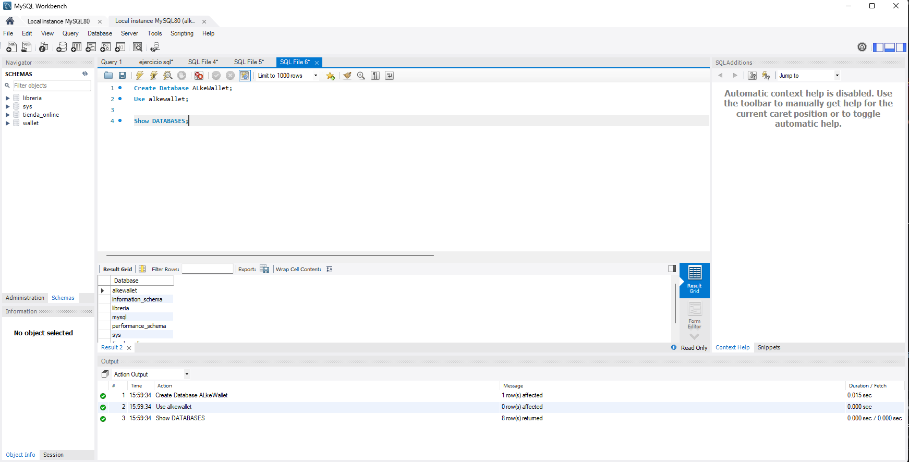

---

## Creación de la tabla Usuarios

Se crea la tabla `Usuarios` utilizando DDL. Se definen restricciones como `NOT NULL`, `UNIQUE`, `PRIMARY KEY` y un valor por defecto para el saldo.

```sql
CREATE TABLE Usuarios (
    user_id INT AUTO_INCREMENT PRIMARY KEY,
    nombre VARCHAR(50) NOT NULL,
    correo VARCHAR(50) UNIQUE NOT NULL,
    contrasena VARCHAR(255) NOT NULL,
    saldo DECIMAL(10,2) DEFAULT 0.00
);
```

### Estructura de la tabla

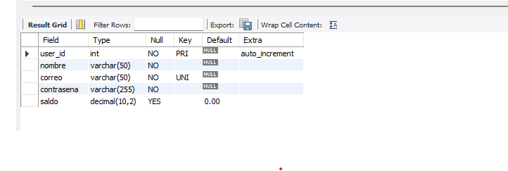

### Tabla creada

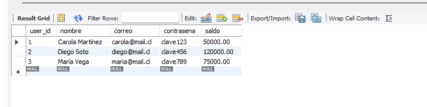

---

## Creación de la tabla Moneda

Se crea la tabla `Moneda` para almacenar las diferentes monedas que pueden ser utilizadas dentro de la Wallet.

Cada moneda posee un identificador, nombre y símbolo.

```sql
CREATE TABLE Moneda (
    currency_id INT AUTO_INCREMENT PRIMARY KEY,
    currency_name VARCHAR(50) NOT NULL,
    currency_symbol VARCHAR(50) NOT NULL
);
```

### Estructura de la tabla

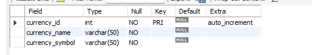

### Tabla creada

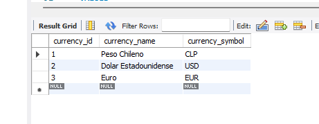

---

## Creación de la tabla Transaccion

Se crea la tabla `Transaccion` para registrar las transferencias realizadas entre los usuarios.

La tabla posee claves foráneas que permiten identificar al usuario que envía, al usuario que recibe y la moneda utilizada en la operación.

```sql
CREATE TABLE Transaccion (
    transaccion_id INT AUTO_INCREMENT PRIMARY KEY,
    sender_user_id INT NOT NULL,
    reciver_user_id INT NOT NULL,
    currency_id INT NOT NULL,
    importe DECIMAL(10,2) NOT NULL,
    transaction_date DATETIME DEFAULT CURRENT_TIMESTAMP,

    FOREIGN KEY (sender_user_id) REFERENCES Usuarios(user_id),
    FOREIGN KEY (reciver_user_id) REFERENCES Usuarios(user_id),
    FOREIGN KEY (currency_id) REFERENCES Moneda(currency_id)
);
```

### Estructura de la tabla

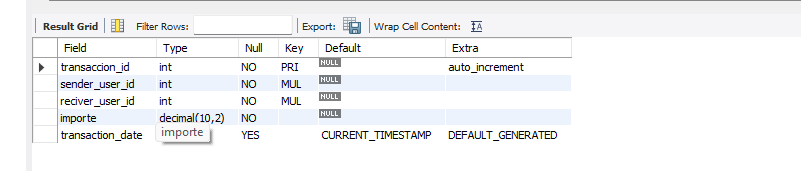

### Tabla creada

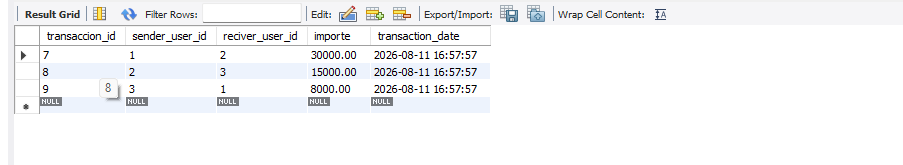

---

## Visualización de las tablas creadas

Para comprobar que las tablas fueron creadas correctamente dentro de la base de datos se utiliza:

```sql
SHOW TABLES;
```

### Resultado

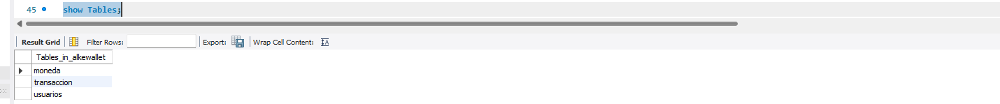

---

## Describir la tabla Usuarios

Para revisar la estructura de una tabla se puede utilizar el comando `DESCRIBE`.

```sql
DESCRIBE Usuarios;
```

Esto permite observar los campos, tipos de datos, claves y restricciones de la tabla.

### Resultado

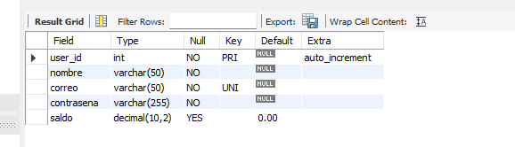

---

# Lección 2 - Consultas SQL

En esta parte se realizaron diferentes consultas para obtener información almacenada dentro de las tablas.

---

## Mostrar todos los usuarios

Se utiliza `SELECT *` para obtener todos los registros y columnas almacenados en la tabla `Usuarios`.

```sql
SELECT *
FROM Usuarios;
```

### Resultado

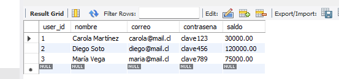

---

## Seleccionar solamente los nombres

También es posible seleccionar solamente las columnas que necesitamos.

En este caso se obtiene únicamente el nombre de cada usuario.

```sql
SELECT nombre
FROM Usuarios;
```

### Resultado

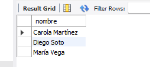

---

## Filtrar usuarios utilizando WHERE

La cláusula `WHERE` permite establecer una condición para filtrar los resultados.

En este caso se buscan los usuarios que tengan un saldo menor a `120000`.

```sql
SELECT *
FROM Usuarios
WHERE saldo < 120000;
```

### Resultado

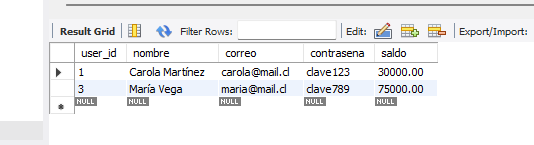

---

## INNER JOIN entre Usuarios y Transaccion

Se utiliza `INNER JOIN` para relacionar la información de la tabla `Transaccion` con la tabla `Usuarios`.

Como cada transacción posee un usuario que envía y otro que recibe, se utiliza la tabla `Usuarios` dos veces mediante alias.

```sql
SELECT
    t.transaccion_id,
    u1.nombre AS remitente,
    u2.nombre AS receptor,
    t.importe,
    t.transaction_date
FROM Transaccion t
INNER JOIN Usuarios u1
    ON t.sender_user_id = u1.user_id
INNER JOIN Usuarios u2
    ON t.reciver_user_id = u2.user_id;
```

En este caso:

- `t` representa la tabla `Transaccion`.
- `u1` representa al usuario remitente.
- `u2` representa al usuario receptor.

### Resultado

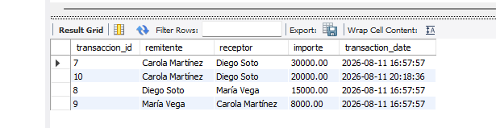

---

## Subconsulta para contar transacciones

Se utiliza una subconsulta para obtener la cantidad total de transacciones enviadas por cada usuario.

```sql
SELECT 
    user_id,
    nombre,
    (
        SELECT COUNT(*)
        FROM Transaccion t
        WHERE t.sender_user_id = u.user_id
    ) AS total_transacciones
FROM Usuarios u;
```

La consulta interna utiliza `COUNT(*)` para contar las transacciones donde el usuario aparece como remitente.

### Resultado

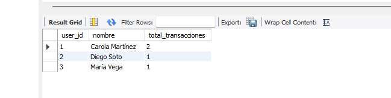

---

# Lección 3 - Manipulación de Datos

En esta sección se utilizan instrucciones DML para insertar y modificar información dentro de las tablas.

---

## Insertar nuevos usuarios

Se utiliza `INSERT INTO` para agregar nuevos registros a la tabla `Usuarios`.

```sql
INSERT INTO Usuarios (nombre, correo, contrasena, saldo)
VALUES
('Carola Martínez', 'carola@mail.cl', 'clave123', 50000.00),
('Diego Soto', 'diego@mail.cl', 'clave456', 120000.00),
('María Vega', 'maria@mail.cl', 'clave789', 75000.00);
```

### Resultado

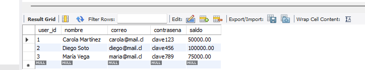

---

## Insertar monedas

También se agregan las monedas disponibles dentro de la Wallet.

```sql
INSERT INTO Moneda (currency_name, currency_symbol)
VALUES
('Peso Chileno', 'CLP'),
('Dolar Estadounidense', 'USD'),
('Euro', 'EUR');
```

Las monedas quedan identificadas mediante su `currency_id`.

---

## Insertar transacciones

Una vez que existen usuarios y monedas se pueden comenzar a registrar las transacciones.

```sql
INSERT INTO Transaccion
(sender_user_id, reciver_user_id, currency_id, importe)
VALUES
(1, 2, 1, 30000.00),
(2, 3, 1, 15000.00),
(3, 1, 1, 8000.00);
```

En este ejemplo:

- `sender_user_id` identifica al usuario que envía.
- `reciver_user_id` identifica al usuario que recibe.
- `currency_id` identifica la moneda.
- `importe` corresponde al dinero transferido.

---

## Mostrar los datos insertados

Para comprobar la información almacenada se consultan las tres tablas.

```sql
SELECT * FROM Usuarios;

SELECT * FROM Transaccion;

SELECT * FROM Moneda;
```

### Usuarios


### Transacciones


### Monedas


---

## Actualizar el saldo de un usuario

Se utiliza `UPDATE` para modificar el saldo de un usuario.

En este ejemplo se descuentan `20000` del usuario con `user_id = 1`.

```sql
UPDATE Usuarios
SET saldo = saldo - 20000.00
WHERE user_id = 1;
```

Luego se puede comprobar el cambio:

```sql
SELECT *
FROM Usuarios;
```

### Resultado

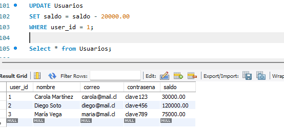

---

# Transacciones SQL

Para realizar operaciones donde se modifican varios datos al mismo tiempo se utilizan transacciones.

Esto permite confirmar los cambios con `COMMIT` o revertirlos con `ROLLBACK` si ocurre algún problema.

---

## Uso de START TRANSACTION y COMMIT

En este ejemplo se realiza una transferencia de `20000` entre dos usuarios.

Primero se descuenta el dinero al usuario que envía, después se suma al receptor y finalmente se registra la operación.

```sql
START TRANSACTION;

-- Restar dinero al usuario que envía
UPDATE Usuarios
SET saldo = saldo - 20000
WHERE user_id = 2;

-- Sumar dinero al receptor
UPDATE Usuarios
SET saldo = saldo + 20000
WHERE user_id = 1;

-- Registrar la transacción
INSERT INTO Transaccion
(sender_user_id, reciver_user_id, currency_id, importe)
VALUES
(2, 1, 1, 20000);

COMMIT;
```

`COMMIT` confirma los cambios realizados y los guarda de manera definitiva en la base de datos.

### Resultado

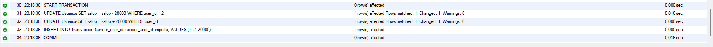

---

## Simulación de un error de integridad referencial

Para comprobar el funcionamiento de las claves foráneas se intenta registrar una transacción utilizando el usuario `999`.

Este usuario no existe dentro de la tabla `Usuarios`.

```sql
START TRANSACTION;

-- Restar dinero al remitente
UPDATE Usuarios
SET saldo = saldo - 20000
WHERE user_id = 1;

-- Sumar dinero al receptor
UPDATE Usuarios
SET saldo = saldo + 20000
WHERE user_id = 2;

-- ERROR: el usuario 999 no existe
INSERT INTO Transaccion
(sender_user_id, reciver_user_id, currency_id, importe)
VALUES
(1, 999, 1, 20000);
```

Al no existir el usuario `999`, MySQL genera un error debido a la restricción de integridad referencial establecida por la `FOREIGN KEY`.

### Error generado

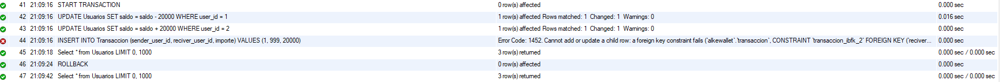

---

## Uso de ROLLBACK

Como la operación anterior genera un error, se utiliza:

```sql
ROLLBACK;
```

`ROLLBACK` permite deshacer los cambios realizados desde el último `START TRANSACTION`.

De esta forma se evita que el saldo de los usuarios sea modificado si la transferencia no pudo completarse correctamente.

---

# Lección 4 - Estructura final de las tablas

Para comprobar la estructura final de las tablas se utiliza `DESCRIBE`.

```sql
DESCRIBE Usuarios;

DESCRIBE Transaccion;

DESCRIBE Moneda;
```

Esto permite revisar los campos, tipos de datos, claves primarias y claves foráneas definidas.

### Usuarios


### Transaccion


### Moneda


---
